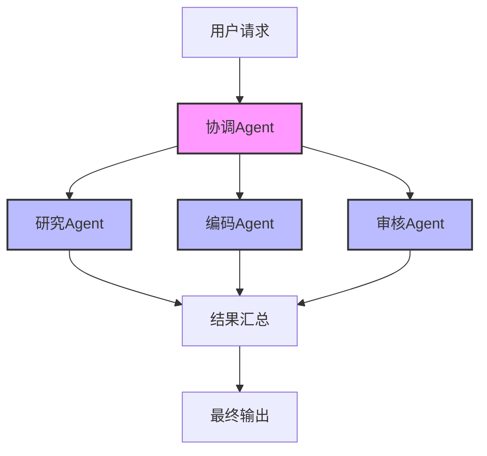

# AI Agents

## 什么是AI Agents

AI Agent(智能代理)是一种能够自主感知环境、做出决策并采取行动以实现特定目标的AI系统。Agent通常结合了大型语言模型(LLM)的理解和推理能力，以及与外部工具和环境交互的能力，能够执行连续的、多步骤的任务。

## Agent的核心组件

### 思维框架
- **任务规划** - 分解目标为子任务
- **推理过程** - 分析情境并进行决策
- **自我反思** - 评估行动结果并调整策略

### 记忆系统
- **短期记忆** - 当前会话上下文
- **长期记忆** - 持久化的知识和经验
- **工作记忆** - 当前任务的中间状态

### 工具使用
- **工具选择** - 为特定任务选择合适工具
- **参数生成** - 构建正确的工具调用参数
- **结果处理** - 理解并利用工具输出

## Agent架构模式

### ReAct模式
结合思考(Reasoning)和行动(Acting)，先推理分析，再决定行动，然后观察结果。

```
思考 -> 行动 -> 观察 -> 思考 -> ...
```

### 反思模式
Agent在标准执行循环中加入自我评估和修正环节。

```
任务 -> 计划 -> 执行 -> 观察 -> 反思 -> 调整 -> 执行 -> ...
```

### 多Agent协作
多个专业Agent协同工作，各自负责特定领域或任务。



## 构建Agent系统

### 基于LangChain构建

```python
from langchain.agents import initialize_agent, Tool
from langchain.chat_models import ChatOpenAI
from langchain.utilities import GoogleSearchAPIWrapper, WikipediaAPIWrapper

# 定义工具
search = GoogleSearchAPIWrapper()
wiki = WikipediaAPIWrapper()

tools = [
    Tool(
        name="Google搜索",
        func=search.run,
        description="用于在网络上搜索最新信息"
    ),
    Tool(
        name="维基百科",
        func=wiki.run,
        description="用于查询百科知识"
    )
]

# 创建LLM
llm = ChatOpenAI(model_name="gpt-3.5-turbo-16k")

# 初始化Agent
agent = initialize_agent(
    tools, 
    llm, 
    agent="chat-conversational-react-description",
    verbose=True,
    memory=ConversationBufferMemory(memory_key="chat_history")
)

# 执行任务
agent.run("研究最新的量子计算进展，并总结三个主要突破")
```

### 自定义Agent行为

```python
# 自定义Agent提示模板
template = """
你是一个专业的研究助手。
步骤:
1. 分析用户的问题，确定需要查询的关键信息
2. 选择合适的工具收集信息
3. 整合信息，形成全面的回答
4. 确保引用信息来源

{chat_history}
用户问题: {input}
{agent_scratchpad}
"""

prompt = CustomPromptTemplate(
    template=template,
    tools=tools,
    input_variables=["input", "chat_history", "agent_scratchpad"]
)
```

## 高级Agent技术

### 工具增强学习
通过强化学习优化Agent对工具的选择和使用。

### 自动代理生成
使用大型语言模型动态生成适合特定任务的代理。

### 元认知Agent
具备对自身思维过程进行监控和调整的能力。

## 应用场景

### 个人助手
- 日程管理
- 信息检索与总结
- 个性化内容推荐

### 工作流自动化
- 数据处理与分析
- 代码生成与调试
- 自动化测试与部署

### 客户服务
- 智能客服代理
- 售后问题解决
- 需求分析与推荐

### 教育辅助
- 个性化学习助手
- 作业辅导与反馈
- 学习材料生成

## 挑战与限制

### 技术挑战
- 长期规划能力有限
- 工具使用效率不稳定
- 自我修正能力不足

### 伦理挑战
- 自主性与控制平衡
- 责任归属不明确
- 潜在的滥用风险

## 未来展望

- 更强的推理与规划能力
- 增强的多模态交互
- 更精细的记忆管理机制
- Agent协作生态系统
- 自学习与自适应能力 