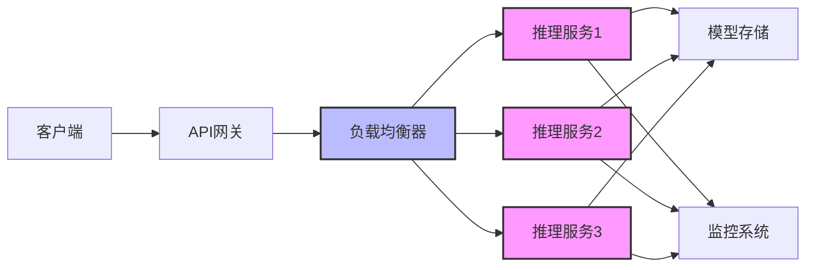

# AI模型部署与优化

## 模型部署基础

模型部署是将训练好的AI模型转化为可用服务的过程，涉及模型优化、接口设计、资源配置和监控等多个环节。良好的部署策略能够平衡性能、成本和可用性，为用户提供稳定高效的AI服务。

## 部署架构

### 基本架构模式



### 常见部署模式

#### 云服务托管
- 使用AWS SageMaker、Azure ML、Google Vertex AI等服务
- 优势：易于扩展、维护简单、高可用性
- 缺点：成本较高、数据隐私顾虑

#### 边缘部署
- 将模型部署到终端设备或边缘服务器
- 优势：低延迟、离线工作、数据隐私保护
- 缺点：计算资源受限、更新维护复杂

#### 混合部署
- 结合云端和边缘计算的优势
- 优势：灵活性强、可根据任务特性调整部署位置
- 缺点：架构复杂、需要更多协调

## 模型优化技术

### 量化

将模型权重从浮点数(如FP32)转换为低精度格式(如INT8、FP16)：

```python
import torch

# FP16量化示例
model_fp16 = model.half()  # 转换为FP16精度

# 使用ONNX Runtime进行INT8量化
import onnxruntime as ort
from onnxruntime.quantization import quantize_dynamic, QuantType

# 量化ONNX模型
quantize_dynamic(
    "model.onnx", 
    "model_quantized.onnx",
    weight_type=QuantType.QInt8
)
```

### 剪枝

移除模型中不重要的权重或神经元，减小模型尺寸：

```python
# 使用PyTorch进行基于阈值的剪枝
import torch.nn.utils.prune as prune

# 对线性层进行L1范数剪枝
prune.l1_unstructured(model.fc1, name="weight", amount=0.3)  # 剪枝30%权重
```

### 知识蒸馏

将大模型(教师)的知识转移到小模型(学生)中：

```python
# 知识蒸馏损失函数
def distillation_loss(student_logits, teacher_logits, temperature=2.0):
    soft_targets = torch.nn.functional.softmax(teacher_logits / temperature, dim=1)
    soft_prob = torch.nn.functional.log_softmax(student_logits / temperature, dim=1)
    return torch.nn.functional.kl_div(soft_prob, soft_targets, reduction='batchmean')
```

### 模型合并

合并多个专业模型的权重，形成一个更高效的统一模型：

```python
# 使用PEFT合并LoRA权重
from peft import PeftModel

base_model = AutoModelForCausalLM.from_pretrained("base_model_path")
peft_model = PeftModel.from_pretrained(base_model, "lora_adapter_path")
merged_model = peft_model.merge_and_unload()  # 合并LoRA权重到基础模型
```

## 推理优化

### 批处理

将多个请求合并为一个批次处理，提高GPU利用率：

```python
# 批处理推理示例
def batch_inference(model, input_batch):
    with torch.no_grad():
        return model(input_batch)
        
# 实现动态批处理服务
class DynamicBatcher:
    def __init__(self, model, max_batch_size=16, timeout=0.1):
        self.model = model
        self.max_batch_size = max_batch_size
        self.timeout = timeout
        self.queue = []
        
    async def add_request(self, input_data):
        future = asyncio.Future()
        self.queue.append((input_data, future))
        if len(self.queue) >= self.max_batch_size:
            await self.process_batch()
        return await future
        
    async def process_batch(self):
        inputs, futures = zip(*self.queue[:self.max_batch_size])
        self.queue = self.queue[self.max_batch_size:]
        
        # 批量处理
        input_batch = torch.stack(inputs)
        outputs = batch_inference(self.model, input_batch)
        
        # 返回结果
        for i, future in enumerate(futures):
            future.set_result(outputs[i])
```

### 缓存管理

缓存常见查询的结果，减少重复计算：

```python
from functools import lru_cache

@lru_cache(maxsize=1024)
def cached_inference(model_input):
    # 输入需要是可哈希类型
    return model(model_input)
```

### 并行处理

利用多GPU或TPU并行处理大型模型：

```python
# 使用DeepSpeed ZeRO优化大模型推理
import deepspeed

# 初始化DeepSpeed推理引擎
ds_engine = deepspeed.init_inference(
    model,
    mp_size=2,  # 模型并行度
    dtype=torch.float16,  # 使用FP16
    replace_with_kernel_inject=True
)

# 推理
output = ds_engine.module.generate(
    input_ids,
    max_length=100
)
```

## 服务化与API设计

### RESTful API

```python
from fastapi import FastAPI, BackgroundTasks
import torch

app = FastAPI()
model = torch.load("model.pt")
model.eval()

@app.post("/predict")
async def predict(data: dict, background_tasks: BackgroundTasks):
    # 异步处理长时间运行的推理任务
    task_id = str(uuid.uuid4())
    background_tasks.add_task(process_inference, data, task_id)
    return {"task_id": task_id, "status": "processing"}

@app.get("/result/{task_id}")
async def get_result(task_id: str):
    # 获取任务结果
    if task_id in results:
        return {"status": "completed", "result": results[task_id]}
    elif task_id in processing:
        return {"status": "processing"}
    else:
        return {"status": "not_found"}
```

### gRPC服务

```python
# 定义proto文件
"""
syntax = "proto3";

service ModelService {
  rpc Predict(PredictRequest) returns (PredictResponse);
}

message PredictRequest {
  string input_text = 1;
}

message PredictResponse {
  string output_text = 1;
  float confidence = 2;
}
"""

# Python gRPC服务实现
class ModelServicer(model_pb2_grpc.ModelServiceServicer):
    def __init__(self, model):
        self.model = model
        
    def Predict(self, request, context):
        input_text = request.input_text
        output, confidence = self.model.predict(input_text)
        return model_pb2.PredictResponse(
            output_text=output,
            confidence=confidence
        )
```

## 监控与可观测性

### 关键指标
- **延迟(Latency)** - 请求响应时间
- **吞吐量(Throughput)** - 单位时间内处理的请求数
- **错误率(Error Rate)** - 失败请求的比例
- **资源利用率** - CPU/GPU/内存使用情况
- **预测准确率** - 模型性能指标

### 监控工具
- Prometheus + Grafana
- TensorBoard
- MLflow
- Weights & Biases

## 部署最佳实践

1. **渐进式部署**
   - 使用金丝雀发布或蓝绿部署策略
   - 逐步增加流量比例

2. **自动扩缩容**
   - 基于负载自动调整实例数量
   - 设置适当的扩缩容阈值和冷却时间

3. **失败恢复**
   - 实现健康检查和自动重启
   - 配置适当的超时和重试策略

4. **版本管理**
   - 为模型和代码维护版本控制
   - 实现模型回滚机制

5. **安全考量**
   - 实施输入验证和清洗
   - 设置访问控制和认证
   - 保护模型权重和敏感数据

## 特定平台部署指南

### HuggingFace模型部署

```python
from transformers import pipeline
import gradio as gr

# 加载模型
classifier = pipeline("sentiment-analysis")

# 创建Gradio界面
def predict(text):
    result = classifier(text)[0]
    return f"标签: {result['label']}, 概率: {result['score']:.3f}"

demo = gr.Interface(
    fn=predict,
    inputs=gr.Textbox(placeholder="输入文本..."),
    outputs="text"
)

# 部署到HuggingFace Spaces
demo.launch()
```

### 本地大模型部署

```python
# 使用llama.cpp部署LLaMA模型
from llama_cpp import Llama

# 加载量化模型
llm = Llama(
    model_path="llama-2-7b.Q4_K_M.gguf",
    n_ctx=2048,  # 上下文窗口
    n_batch=512  # 批处理大小
)

# 生成文本
output = llm.create_completion(
    "人工智能的未来发展趋势是什么？",
    max_tokens=512,
    temperature=0.7,
    top_p=0.95,
    repeat_penalty=1.1
)

print(output["choices"][0]["text"])
```

## 未来趋势

- **模型即服务(MaaS)** - 专业化的模型服务平台
- **联邦推理** - 保护隐私的分布式推理
- **硬件加速器** - 专用AI推理芯片普及
- **自适应推理** - 根据输入复杂度动态调整计算资源
- **可解释性工具** - 为推理过程提供透明度和可解释性 