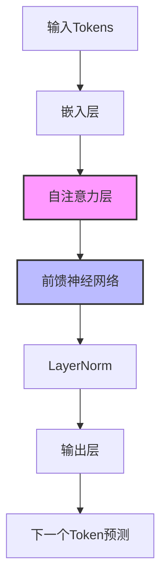

# 大型语言模型(LLM)

## 什么是大型语言模型

大型语言模型(Large Language Models, LLMs)是一类基于深度学习的自然语言处理模型，它们通过在海量文本数据上训练，习得了人类语言的规律和知识。这些模型通常具有数十亿到数万亿参数，能够理解、生成和翻译文本，回答问题，编写代码，甚至进行创造性创作。

## 常见大模型

### 闭源商业模型
- **GPT系列** (OpenAI) - GPT-3.5-Turbo, GPT-4, GPT-4o
- **Claude系列** (Anthropic) - Claude 2, Claude 3 (Opus/Sonnet/Haiku)
- **Gemini系列** (Google) - Gemini Pro, Gemini Ultra
- **Mistral Large** (Mistral AI)
- **Command系列** (Cohere)

### 开源模型
- **LLaMA系列** (Meta) - LLaMA 2, LLaMA 3
- **Mistral系列** (Mistral AI) - Mistral 7B, Mixtral 8x7B
- **Yi系列** (01.AI)
- **Qwen系列** (阿里巴巴)
- **GLM系列** (清华大学)
- **Falcon系列** (阿联酋AI公司)

## 模型架构

大多数现代LLM基于Transformer架构，尤其是解码器(Decoder-only)架构：

1. **输入嵌入层** - 将token转换为向量表示
2. **多层Transformer块** - 自注意力机制和前馈网络
3. **输出层** - 预测下一个token的概率分布

## 训练方法

### 预训练
- 自回归语言建模（预测下一个token）
- 在海量文本语料上训练
- 计算资源消耗巨大（数千GPU天）

### 微调
- 指令微调(Instruction Tuning)
- RLHF(基于人类反馈的强化学习)
- LoRA等参数高效微调方法

## 能力与限制

### 主要能力
- 自然语言理解与生成
- 多语言翻译和理解
- 代码生成与理解
- 知识检索与总结
- 推理与问题解决

### 局限性
- 幻觉（生成不准确信息）
- 知识截止日期
- 缺乏实时访问外部信息的能力
- 无法执行真正的数学/逻辑推理
- 上下文窗口限制

## 应用场景

- 智能助手与聊天机器人
- 内容创作与编辑
- 代码生成与程序设计
- 教育与学习辅助
- 客户服务与支持

## 未来发展方向

- 更长的上下文窗口
- 多模态能力增强
- 更强的推理能力
- 与外部工具的结合
- 降低训练和推理成本 