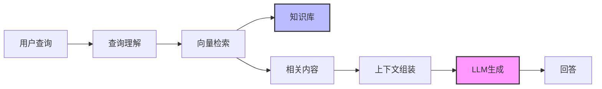

# 检索增强生成(RAG)

## 什么是RAG

检索增强生成(Retrieval-Augmented Generation, RAG)是一种将检索系统与生成式AI模型结合的技术框架，它使大型语言模型能够访问和利用外部知识库中的信息，从而生成更准确、更新且有事实依据的回答。

## RAG的核心优势

- **减少幻觉** - 基于实际检索到的信息生成回答
- **知识更新** - 无需重新训练模型即可更新知识
- **信息透明** - 可以提供引用和来源
- **领域适应** - 轻松适应特定领域知识
- **降低成本** - 比全面微调模型成本更低

## RAG技术架构

### 基本架构



### 关键组件

1. **文档处理** - 文本分块、清洗和预处理
2. **嵌入模型** - 将文本转换为向量表示
3. **向量数据库** - 存储和索引文档向量
4. **检索器** - 查找与查询相关的文档
5. **大型语言模型** - 基于检索内容生成回答
6. **编排层** - 协调各组件间的交互

## 实现RAG系统

### 文档处理

```python
from langchain.text_splitter import RecursiveCharacterTextSplitter

# 文档分块
text_splitter = RecursiveCharacterTextSplitter(
    chunk_size=1000,
    chunk_overlap=200,
    length_function=len,
)

chunks = text_splitter.split_documents(documents)
```

### 向量化和存储

```python
from langchain.embeddings import OpenAIEmbeddings
from langchain.vectorstores import Chroma

# 创建嵌入
embeddings = OpenAIEmbeddings()

# 存储到向量数据库
vectorstore = Chroma.from_documents(
    documents=chunks,
    embedding=embeddings,
    persist_directory="./chroma_db"
)
```

### 构建RAG链

```python
from langchain.chat_models import ChatOpenAI
from langchain.chains import RetrievalQA

# 设置语言模型
llm = ChatOpenAI(model_name="gpt-3.5-turbo")

# 创建RAG链
qa_chain = RetrievalQA.from_chain_type(
    llm=llm,
    chain_type="stuff",
    retriever=vectorstore.as_retriever(
        search_kwargs={"k": 3}
    )
)

# 查询
result = qa_chain.run("什么是向量数据库?")
```

## 高级RAG技术

### 查询转换
根据原始查询生成多个变体查询，以提高检索质量。

### 重排序机制
使用交叉编码器等模型对检索结果进行重新排序，提高最相关文档的排名。

### 混合检索
结合关键词搜索和向量检索的优势，实现更全面的信息获取。

### 自适应检索
根据查询复杂度动态调整检索数量和策略。

## 常见挑战与解决方案

### 相关性挑战
- **问题**: 检索结果与查询不相关
- **解决方案**: 优化嵌入模型、调整分块策略、实现重排序

### 上下文长度限制
- **问题**: 检索结果超出LLM上下文窗口
- **解决方案**: 压缩技术、分层检索、动态截断

### 多语言支持
- **问题**: 跨语言检索效果差
- **解决方案**: 多语言嵌入模型、翻译中间层

## RAG评估指标

- **准确性** - 回答中事实信息的正确性
- **相关性** - 回答与查询的匹配度
- **全面性** - 回答是否涵盖查询的所有方面
- **引用精度** - 引用的准确性和相关性
- **延迟** - 端到端响应时间

## 未来发展方向

- 多模态RAG(图像、音频、视频)
- 更高效的检索算法
- 与Agent框架的深度集成
- 个性化知识检索
- 更强的知识推理能力 