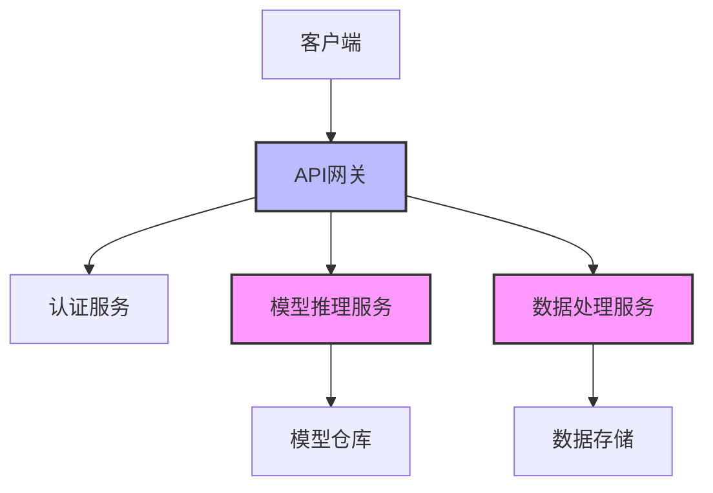
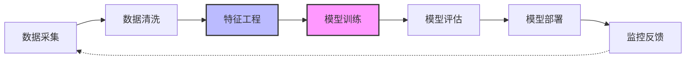
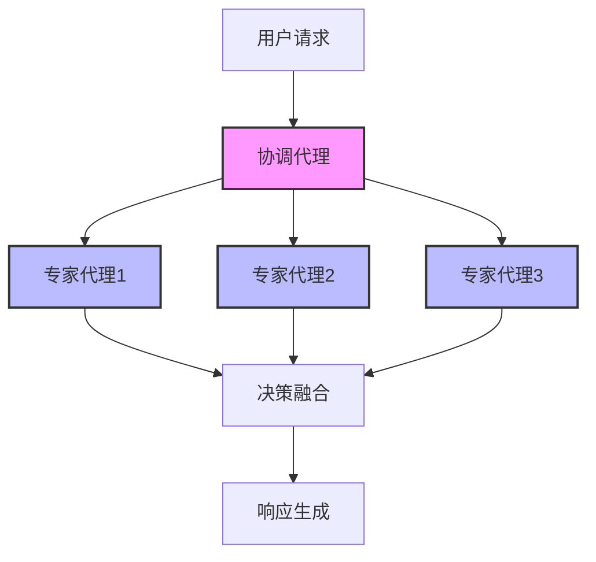

# AI架构设计

## 什么是AI架构

AI架构是指设计和构建人工智能系统的整体结构和组织方式，包括数据流、模型选择、组件交互以及部署策略等关键要素。良好的AI架构能确保系统的可扩展性、可维护性、性能和可靠性，同时满足特定业务需求。

## 基础架构模式

### 微服务式AI架构



特点：
- 各功能组件独立部署和扩展
- 服务间通过API通信
- 更灵活的技术栈选择
- 便于单独更新和维护组件

### 管道式架构



特点：
- 数据和处理以流水线方式组织
- 适合ML/AI工作流
- 各阶段可以独立优化
- 便于实现持续集成/部署

### 多代理架构



特点：
- 多个AI代理协作完成复杂任务
- 各代理专注特定领域或能力
- 灵活的协调和通信机制
- 系统能力可通过添加代理扩展

## 现代AI系统组件

### 核心组件

1. **数据层**
   - 数据采集与存储
   - 特征存储
   - 数据版本控制

2. **模型层**
   - 模型训练基础设施
   - 模型注册表
   - 特征工程管道

3. **推理层**
   - 在线推理服务
   - 批量推理系统
   - 模型缓存机制

4. **应用层**
   - API和集成接口
   - 用户界面
   - 业务逻辑集成

5. **监控与反馈**
   - 性能监控
   - 数据漂移检测
   - A/B测试框架

## 设计原则

### 可扩展性
- 水平扩展以处理增长的负载
- 组件化设计便于扩展功能
- 资源自动伸缩机制

### 可靠性
- 故障检测与恢复
- 降级策略
- 备份与冗余

### 可观测性
- 全面的日志记录
- 指标收集与仪表板
- 分布式追踪

### 安全性
- 数据加密与访问控制
- 模型安全保障
- 合规与审计机制

## 实际架构示例

### RAG应用架构

```python
# RAG系统架构实现示例
from langchain.embeddings import OpenAIEmbeddings
from langchain.vectorstores import FAISS
from langchain.llms import OpenAI
from langchain.chains import RetrievalQA

# 1. 数据层 - 向量存储
embeddings = OpenAIEmbeddings()
vectorstore = FAISS.from_documents(documents, embeddings)

# 2. 模型层 - LLM设置
llm = OpenAI(temperature=0.2)

# 3. 推理层 - 检索QA链
qa_chain = RetrievalQA.from_chain_type(
    llm=llm,
    chain_type="stuff",
    retriever=vectorstore.as_retriever(search_kwargs={"k": 3})
)

# 4. 应用层 - API端点
def query_endpoint(question: str):
    try:
        # 执行推理
        result = qa_chain.run(question)
        # 监控与日志
        log_query(question, result)
        return {"status": "success", "result": result}
    except Exception as e:
        # 错误处理与降级
        fallback_response = llm("无法检索信息，但我会尝试回答: " + question)
        log_error(str(e))
        return {"status": "degraded", "result": fallback_response}
```

### 多模态系统架构

```python
# 多模态系统架构示例
import torch
from transformers import AutoProcessor, AutoModel
from fastapi import FastAPI, File, UploadFile

app = FastAPI()

# 1. 模型层 - 加载视觉与文本模型
processor = AutoProcessor.from_pretrained("openai/clip-vit-base-patch32")
model = AutoModel.from_pretrained("openai/clip-vit-base-patch32")

# 2. 推理层 - 图像理解服务
def process_image(image, text_queries):
    inputs = processor(
        text=text_queries,
        images=image,
        return_tensors="pt",
        padding=True
    )
    with torch.no_grad():
        outputs = model(**inputs)
    
    # 计算相似度
    image_features = outputs.image_embeds
    text_features = outputs.text_embeds
    similarity = torch.nn.functional.cosine_similarity(text_features, image_features)
    
    return {
        query: score.item()
        for query, score in zip(text_queries, similarity)
    }

# 3. 应用层 - API端点
@app.post("/analyze_image/")
async def analyze_image(file: UploadFile, queries: list[str]):
    image = Image.open(await file.read())
    results = process_image(image, queries)
    return {
        "analysis": results,
        "top_match": max(results.items(), key=lambda x: x[1])[0]
    }
```

## 架构评估框架

### 性能指标
- 延迟(Latency) - 请求响应时间
- 吞吐量(Throughput) - 单位时间处理请求数
- 资源利用率 - CPU/GPU/内存使用效率

### 质量指标
- 准确性 - 模型性能指标
- 稳定性 - 错误率和恢复能力
- 可维护性 - 代码质量和文档

### 成本指标
- 计算资源成本
- 人力维护成本
- 扩展的边际成本

## 架构演进

### 从单体到微服务
- 识别自然边界进行拆分
- 建立服务间通信标准
- 逐步迁移而非完全重写

### 从批处理到实时
- 增加流处理能力
- 实现实时特征计算
- 部署在线学习机制

### 从云端到边缘
- 模型压缩与优化
- 建立模型更新机制
- 设计在线/离线混合模式

## 未来趋势

- **模型即服务(MaaS)** - 专门的模型服务化平台
- **AI编排系统** - 智能组合多个AI能力
- **自适应架构** - 根据负载和性能自动调整
- **隐私保护计算** - 联邦学习和加密计算
- **AI/ML运维自动化** - 自动调优与恢复 