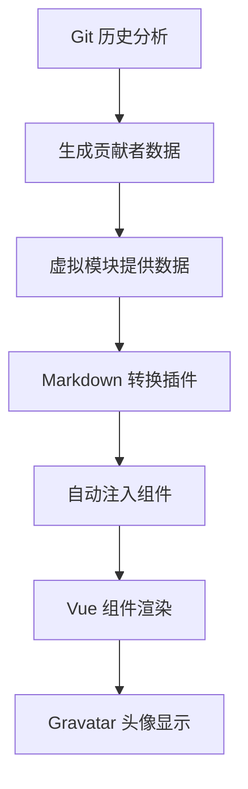

# VitePress 贡献者组件自动化实现

## 概述

本文档详细记录了如何在 VitePress 项目中实现类似 VueUse 的贡献者组件自动添加功能。该功能能够基于 Git 历史自动分析每个文档的贡献者，并在文档末尾自动添加贡献者展示组件。

## 需求背景

在多人协作的知识库项目中，我们希望能够：
- 自动识别每个文档的贡献者
- 在文档末尾展示贡献者信息
- 支持中文路径和文件名
- 按贡献次数排序显示
- 集成 Gravatar 头像服务

## 技术架构

### 整体设计



### 核心组件

1. **贡献者分析脚本** (`scripts/contributors.js`)
2. **虚拟模块插件** (`plugins/contributors.js`)
3. **Markdown 转换插件** (`plugins/markdown-transform.js`)
4. **贡献者展示组件** (`components/Contributors.vue`)

## 详细实现

### 1. 贡献者分析脚本

创建 `apps/docs/scripts/contributors.js`：

```javascript
import { createHash } from 'crypto'
import { exec } from 'child_process'
import { promisify } from 'util'
import path from 'path'
import fs from 'fs'

const execAsync = promisify(exec)

/**
 * @typedef {Object} ContributorInfo
 * @property {string} name - 贡献者姓名
 * @property {string} email - 贡献者邮箱
 * @property {number} count - 贡献次数
 * @property {string} hash - 邮箱的MD5哈希值
 */

/**
 * 获取指定路径的贡献者信息
 */
export async function getContributorsAt(filePath) {
  try {
    // 使用 UTF-8 编码处理中文路径
    const gitCommand = `git log --pretty=format:"%an|%ae" --encoding=UTF-8 -- "${filePath}"`
    
    const { stdout } = await execAsync(gitCommand, {
      encoding: 'utf8',
      env: { ...process.env, LC_ALL: 'C.UTF-8' }
    })
    
    if (!stdout.trim()) {
      return []
    }
    
    const commits = stdout
      .split('\n')
      .filter(line => line.trim())
      .map(line => {
        const [name, email] = line.split('|')
        return { name: name?.trim(), email: email?.trim() }
      })
      .filter(commit => commit.name && commit.email)
    
    // 统计每个贡献者的提交次数
    const contributorMap = new Map()
    
    commits.forEach(({ name, email }) => {
      const key = email.toLowerCase()
      if (contributorMap.has(key)) {
        contributorMap.get(key).count++
      } else {
        contributorMap.set(key, {
          name,
          email,
          count: 1,
          hash: createHash('md5').update(email.toLowerCase()).digest('hex')
        })
      }
    })
    
    // 按贡献次数排序
    return Array.from(contributorMap.values())
      .sort((a, b) => b.count - a.count)
  } catch (error) {
    console.warn(`获取贡献者信息失败 (${filePath}):`, error.message)
    return []
  }
}

/**
 * 获取所有文档的贡献者信息
 */
export async function getDocumentContributors() {
  const currentDir = process.cwd()
  const docsDir = currentDir.endsWith('apps/docs') || currentDir.endsWith('apps\\docs')
    ? currentDir 
    : path.resolve(currentDir, 'apps/docs')
  
  const targetDirs = ['client', 'server', 'ai', 'devops', 'systems']
  
  const allFiles = []
  for (const dir of targetDirs) {
    const dirPath = path.join(docsDir, dir)
    if (fs.existsSync(dirPath)) {
      allFiles.push(...getAllMarkdownFiles(dirPath))
    }
  }
  
  console.log(`正在分析 ${allFiles.length} 个文档文件的贡献者...`)
  
  const contributorsMap = {}
  
  // 并行处理以提高性能
  const batchSize = 10
  for (let i = 0; i < allFiles.length; i += batchSize) {
    const batch = allFiles.slice(i, i + batchSize)
    const batchResults = await Promise.all(
      batch.map(async (filePath) => {
        const contributors = await getContributorsAt(filePath)
        const relativePath = path.relative(docsDir, filePath)
        return { key: relativePath, contributors }
      })
    )
    
    batchResults.forEach(({ key, contributors }) => {
      if (contributors.length > 0) {
        const normalizedKey = generateContributorKey(key.replace(/\\/g, '/'))
        contributorsMap[normalizedKey] = contributors
      }
    })
    
    console.log(`已处理 ${Math.min(i + batchSize, allFiles.length)}/${allFiles.length} 个文件`)
  }
  
  console.log(`成功分析了 ${Object.keys(contributorsMap).length} 个有贡献记录的文档`)
  return contributorsMap
}

/**
 * 根据文档路径生成贡献者组件的唯一键
 */
export function generateContributorKey(filePath) {
  return filePath
    .replace(/\.md$/, '')
    .replace(/\\/g, '/')
    .replace(/\/index$/, '')
}

function getAllMarkdownFiles(dir) {
  const files = []
  const items = fs.readdirSync(dir, { withFileTypes: true })
  
  for (const item of items) {
    if (item.name.startsWith('.')) continue
    
    const fullPath = path.join(dir, item.name)
    if (item.isDirectory()) {
      files.push(...getAllMarkdownFiles(fullPath))
    } else if (item.name.endsWith('.md')) {
      files.push(fullPath)
    }
  }
  
  return files
}
```

### 2. 虚拟模块插件

创建 `apps/docs/.vitepress/plugins/contributors.js`：

```javascript
/**
 * 贡献者数据虚拟模块插件
 * @param {Record<string, Array>} data - 贡献者数据
 * @returns {import('vite').Plugin} Vite 插件
 */
export function ContributorsPlugin(data) {
  const virtualModuleId = 'virtual:contributors'
  const resolvedVirtualModuleId = '\0' + virtualModuleId

  return {
    name: 'contributors-plugin',
    resolveId(id) {
      if (id === virtualModuleId) {
        return resolvedVirtualModuleId
      }
    },
    load(id) {
      if (id === resolvedVirtualModuleId) {
        return `export default ${JSON.stringify(data)}`
      }
    },
  }
}
```

### 3. Markdown 转换插件

创建 `apps/docs/.vitepress/plugins/markdown-transform.js`：

```javascript
import path from 'path'
import { generateContributorKey } from '../../scripts/contributors.js'

/**
 * Markdown 转换插件
 * @returns {import('vite').Plugin} Vite 插件
 */
export function MarkdownTransformPlugin() {
  return {
    name: 'docs-markdown-transform',
    enforce: 'pre',
    async transform(code, id) {
      // 只处理 Markdown 文件
      if (!id.endsWith('.md')) {
        return null
      }

      // 获取文件相对路径
      let relativePath = path.relative(process.cwd(), id)
      
      const isInDocsDir = process.cwd().endsWith('apps/docs') || process.cwd().endsWith('apps\\docs')
      if (!isInDocsDir && !relativePath.startsWith('apps/docs/')) {
        return null
      }
      
      if (relativePath.startsWith('apps/docs/')) {
        relativePath = relativePath.substring('apps/docs/'.length)
      }

      const targetDirs = ['client', 'server', 'ai', 'devops', 'systems']
      const pathSegments = relativePath.split(path.sep)
      
      // 检查是否在目标目录中
      if (pathSegments.length < 1 || !targetDirs.includes(pathSegments[0])) {
        return null
      }

      // 跳过顶层 index.md
      if (pathSegments.length === 1 && pathSegments[0] === 'index.md') {
        return null
      }

      // 生成贡献者组件的键
      const docsRelativePath = pathSegments.join('/')
      const contributorKey = generateContributorKey(docsRelativePath)

      // 添加贡献者组件到文档末尾
      const contributorsSection = `

<Contributors doc-path="${contributorKey}" show-title />
`

      // 使用 replacer 函数处理内容注入
      const updatedCode = replacer(code, contributorsSection, 'CONTRIBUTORS', 'tail')
      
      return updatedCode
    },
  }
}

/**
 * 内容替换工具函数
 */
function replacer(code, value, key, insert = 'none') {
  const START = `<!--${key}_STARTS-->`
  const END = `<!--${key}_ENDS-->`
  const regex = new RegExp(`${START}[\\s\\S]*?${END}`, 'im')

  const target = value ? `${START}${value.trim()}\n${END}` : `${START}${END}`

  if (!code.match(regex)) {
    if (insert === 'none') {
      return code
    } else if (insert === 'head') {
      return `${target}\n\n${code}`
    } else {
      return `${code}\n\n${target}`
    }
  }

  return code.replace(regex, target)
}
```

### 4. 贡献者展示组件

创建 `apps/docs/.vitepress/theme/components/Contributors.vue`：

```vue
<template>
  <div class="contributors-wrapper" v-if="contributors.length > 0">
    <h2 v-if="showTitle" class="contributors-title" id="贡献者">贡献者</h2>
    <div class="contributors-section">
      <div class="contributors-grid">
        <div 
          v-for="contributor in contributors" 
          :key="contributor.hash" 
          class="contributor-item"
          :title="contributor.name"
        >
          
          <div class="contributor-name">{{ contributor.name }}</div>
        </div>
      </div>
    </div>
  </div>
  <div v-else-if="showTitle" class="no-contributors">
    <h2 class="contributors-title" id="贡献者">贡献者</h2>
    <p>暂无贡献记录</p>
  </div>
</template>

<script setup>
import { computed } from 'vue'
import contributorsData from 'virtual:contributors'

const props = defineProps({
  docPath: {
    type: String,
    required: true
  },
  showTitle: {
    type: Boolean,
    default: false
  }
})

/**
 * 获取当前文档的贡献者列表
 */
const contributors = computed(() => {
  const docContributors = contributorsData[props.docPath]
  
  if (!docContributors || !Array.isArray(docContributors)) {
    return []
  }
  return docContributors
})

/**
 * 生成头像 URL
 */
function getAvatarUrl(hash) {
  if (!hash || hash.length !== 32) {
    console.warn('Invalid hash for avatar:', hash)
    return getDefaultAvatar('Unknown')
  }
  
  return `https://www.gravatar.com/avatar/${hash}?s=40&r=g&d=404`
}

/**
 * 生成默认头像URL
 */
function getDefaultAvatar(name) {
  const colors = [
    '6366f1', 'ef4444', 'f59e0b', '10b981', 
    '8b5cf6', 'f97316', '06b6d4', 'ec4899'
  ]
  
  const colorIndex = name.split('').reduce((acc, char) => acc + char.charCodeAt(0), 0) % colors.length
  const backgroundColor = colors[colorIndex]
  
  return `https://ui-avatars.com/api/?name=${encodeURIComponent(name)}&size=40&background=${backgroundColor}&color=ffffff&rounded=true&bold=true&format=svg`
}

/**
 * 处理图片加载错误
 */
function handleImageError(event) {
  const imgSrc = event.target.src
  const contributor = contributors.value.find(c => imgSrc.includes(c.hash))
  
  if (contributor) {
    console.log('Gravatar 加载失败，切换到默认头像:', contributor.name)
    event.target.src = getDefaultAvatar(contributor.name)
  }
}
</script>

<style scoped>
.contributors-wrapper {
  margin-top: 2rem;
}

.contributors-title {
  font-size: 1.5rem;
  font-weight: 600;
  color: var(--vp-c-text-1);
  margin-bottom: 1rem;
  border-bottom: 1px solid var(--vp-c-divider);
  padding-bottom: 0.5rem;
}

.contributors-section {
  margin-top: 0;
}

.contributors-grid {
  display: flex;
  flex-wrap: wrap;
  gap: 0.75rem;
  align-items: center;
}

.contributor-item {
  display: flex;
  align-items: center;
  gap: 0.5rem;
  transition: all 0.2s ease;
  cursor: default;
}

.contributor-item:hover {
  transform: translateY(-1px);
}

.contributor-avatar {
  width: 32px;
  height: 32px;
  border-radius: 50%;
  flex-shrink: 0;
  border: 1px solid var(--vp-c-divider-light);
  transition: all 0.2s ease;
}

.contributor-item:hover .contributor-avatar {
  border-color: var(--vp-c-brand);
  box-shadow: 0 2px 8px rgba(0, 0, 0, 0.1);
}

.contributor-name {
  font-size: 0.875rem;
  color: var(--vp-c-text-1);
  white-space: nowrap;
}

.no-contributors {
  margin-top: 2rem;
  padding: 1.5rem;
  text-align: center;
  color: var(--vp-c-text-2);
  background: var(--vp-c-bg-soft);
  border-radius: 8px;
  border: 1px solid var(--vp-c-divider);
}

@media (prefers-color-scheme: dark) {
  .contributor-item:hover .contributor-avatar {
    box-shadow: 0 2px 8px rgba(0, 0, 0, 0.3);
  }
}

@media (max-width: 768px) {
  .contributors-grid {
    gap: 0.5rem;
  }
  
  .contributor-avatar {
    width: 28px;
    height: 28px;
  }
  
  .contributor-name {
    font-size: 0.8rem;
  }
}
</style>
```

### 5. VitePress 配置集成

在 `apps/docs/.vitepress/config.js` 中集成插件：

```javascript
import { defineConfig } from 'vitepress'
import { ContributorsPlugin } from './plugins/contributors.js'
import { MarkdownTransformPlugin } from './plugins/markdown-transform.js'
import { getDocumentContributors } from '../scripts/contributors.js'

// 获取贡献者数据
const contributorsData = await getDocumentContributors()
console.log(`🎯 [VitePress Config] 贡献者数据加载完成，共 ${Object.keys(contributorsData).length} 个文档`)

export default defineConfig({
  // ... 其他配置
  
  vite: {
    plugins: [
      MarkdownTransformPlugin(),
      ContributorsPlugin(contributorsData),
    ],
    // ... 其他配置
  },
  
  // ... 其他配置
})
```

## 核心特性

### 1. Git 历史分析
- 使用 `git log` 命令分析每个文档的提交历史
- 支持中文路径和文件名（UTF-8 编码）
- 统计每个贡献者的提交次数
- 按贡献次数降序排列

### 2. MD5 哈希与 Gravatar
```javascript
// 邮箱哈希化过程
const email = "user@example.com"
const normalizedEmail = email.toLowerCase().trim()
const hash = createHash('md5').update(normalizedEmail).digest('hex')
const gravatarUrl = `https://www.gravatar.com/avatar/${hash}?s=40&r=g&d=404`
```

### 3. 虚拟模块系统
- 通过 Vite 虚拟模块提供贡献者数据
- 构建时生成，运行时零开销
- 支持热更新和开发模式

### 4. 自动注入机制
- Markdown 转换插件自动识别目标文档
- 在文档末尾注入贡献者组件
- 使用 HTML 注释标记防止重复注入

## 高级功能

### 1. 头像回退机制
```javascript
// 头像加载优先级
Gravatar 头像 → 默认生成头像 → 错误处理
```

### 2. 性能优化
- 并行处理 Git 历史分析
- 批量处理文件（每批 10 个）
- 虚拟模块缓存机制

### 3. 路径处理
- 支持 Windows 和 Unix 路径分隔符
- 处理相对路径和绝对路径
- 支持中文路径和文件名

## 使用方法

### 自动注入
插件会自动在以下目录的文档中添加贡献者组件：
- `client/`
- `server/`
- `ai/`
- `devops/`
- `systems/`

### 手动添加
也可以在任何 Markdown 文件中手动添加：

```markdown
<!-- 带标题 -->
<Contributors doc-path="client/web前端技术/框架与库" show-title />

<!-- 不带标题 -->
<Contributors doc-path="client/web前端技术/框架与库" />
```

## 故障排除

### 1. 中文路径问题
确保设置正确的环境变量：
```javascript
env: { ...process.env, LC_ALL: 'C.UTF-8' }
```

### 2. Git 历史问题
检查文件是否有完整的 Git 历史记录：
```bash
git log --oneline -- "path/to/file.md"
```

### 3. 头像显示问题
- 检查 Gravatar 服务是否可访问
- 确认邮箱是否在 Gravatar 注册
- 查看浏览器网络请求状态

## 总结

这个贡献者组件实现了类似 VueUse 的自动化功能，主要优势：

1. **完全自动化**：无需手动维护贡献者信息
2. **实时准确**：基于 Git 历史，数据始终最新
3. **性能优化**：构建时处理，运行时零开销
4. **中文友好**：完整支持中文路径和文件名
5. **可扩展性**：插件化架构，易于功能扩展

该实现参考了 VueUse 的设计思路，但针对我们的具体需求进行了定制化开发，特别是加强了中文支持和 monorepo 项目的适配。 