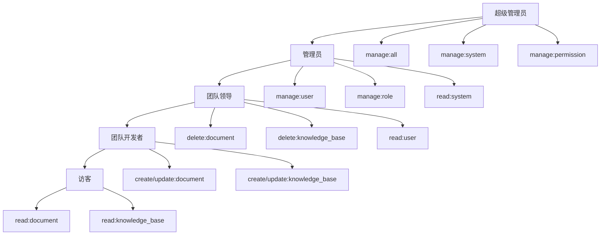

# RBAC2 权限控制系统

## 🎯 系统概述

基于RBAC2模型实现的权限控制系统，支持角色层次结构、会话管理和约束条件，提供完整的企业级访问控制解决方案。

## 📊 RBAC2 模型特性

### 核心组件

1. **用户（Users）** - 系统中的实际用户
2. **角色（Roles）** - 权限的集合，支持层次结构
3. **权限（Permissions）** - 对资源的操作许可
4. **会话（Sessions）** - 用户的活动会话，可动态激活/停用角色
5. **约束（Constraints）** - 访问控制的限制条件

### RBAC2 增强特性

- ✅ **角色层次结构** - 支持角色继承，高级角色自动获得低级角色权限
- ✅ **会话管理** - 用户可在会话中选择性激活角色
- ✅ **约束条件** - 支持多种访问控制约束

## 👥 角色层次体系

### 5层角色架构

```
超级管理员 (Level 4)
    ↓ 继承
管理员 (Level 3)
    ↓ 继承  
团队领导 (Level 2)
    ↓ 继承
团队开发者 (Level 1)
    ↓ 继承
访客 (Level 0)
```

| 角色 | 英文名 | 层级 | 权限范围 | 使用场景 |
|------|--------|------|----------|----------|
| **超级管理员** | `super_admin` | 4 | 系统所有权限 | 系统维护、最高权限 |
| **管理员** | `admin` | 3 | 用户、角色、系统管理 | 平台日常管理 |
| **团队领导** | `team_leader` | 2 | 团队和内容管理 | 团队管理、项目负责 |
| **团队开发者** | `team_developer` | 1 | 文档、知识库管理 | 内容创建和维护 |
| **访客** | `visitor` | 0 | 只读权限 | 内容查看 |

## 📋 权限矩阵

### 操作类型 (Action)
```typescript
CREATE  // 创建
READ    // 读取
UPDATE  // 更新  
DELETE  // 删除
MANAGE  // 管理（包含所有操作）
```

### 资源类型 (Subject)
```typescript
USER           // 用户管理
ROLE           // 角色管理
PERMISSION     // 权限管理
DOCUMENT       // 文档管理
KNOWLEDGE_BASE // 知识库管理
SYSTEM         // 系统管理
ALL            // 所有资源
```

### 有效权限分配（包含继承）

#### 超级管理员 (super_admin)
**直接权限：**
- ✅ `manage:all` - 拥有系统所有权限
- ✅ `manage:system` - 管理系统
- ✅ `manage:permission` - 管理权限

**继承权限：** 包含管理员、团队领导、团队开发者、访客的所有权限

#### 管理员 (admin)
**直接权限：**
- ✅ `manage:user` - 管理用户
- ✅ `manage:role` - 管理角色
- ✅ `read:system` - 查看系统信息

**继承权限：** 包含团队领导、团队开发者、访客的所有权限

#### 团队领导 (team_leader)
**直接权限：**
- ✅ `delete:document` - 删除文档
- ✅ `delete:knowledge_base` - 删除知识库
- ✅ `read:user` - 查看用户信息

**继承权限：** 包含团队开发者、访客的所有权限

#### 团队开发者 (team_developer)
**直接权限：**
- ✅ `create:document` - 创建文档
- ✅ `update:document` - 更新文档
- ✅ `create:knowledge_base` - 创建知识库
- ✅ `update:knowledge_base` - 更新知识库

**继承权限：** 包含访客的所有权限

#### 访客 (visitor)
**直接权限：**
- ✅ `read:document` - 查看文档
- ✅ `read:knowledge_base` - 查看知识库

## 🔧 技术实现

### 核心组件
- **RbacAbilityFactory** - RBAC权限能力工厂
- **RbacPermissionsGuard** - RBAC权限守卫
- **SessionService** - 会话管理服务
- **RoleHierarchyService** - 角色层次管理服务
- **@RequirePermission** - 权限装饰器

### 权限检查流程
1. 请求到达控制器
2. `RbacPermissionsGuard` 拦截请求
3. 读取 `@RequirePermission` 装饰器配置
4. 通过 `RbacAbilityFactory` 创建权限检查器
5. 检查用户权限（包含继承权限）
6. 允许或拒绝访问

### 会话管理流程
1. 用户登录创建会话
2. 默认激活用户的所有角色
3. 用户可选择性激活/停用角色
4. 权限检查基于会话中的激活角色
5. 会话过期自动清理

## 🛡️ 约束系统

### 约束类型

#### 1. 互斥约束 (Mutual Exclusion)
- **作用**：确保用户不能同时拥有冲突的角色
- **示例**：管理员和超级管理员不能同时激活

#### 2. 基数约束 (Cardinality)
- **作用**：限制角色的最大用户数或用户的最大角色数
- **示例**：用户最多只能同时拥有5个角色

#### 3. 先决条件约束 (Prerequisite)
- **作用**：要求用户必须先拥有某个角色才能获得另一个角色
- **示例**：必须先是团队开发者才能成为团队领导

#### 4. 时间约束 (Temporal)
- **作用**：角色只能在特定时间段内激活
- **示例**：高级角色只能在工作时间激活

#### 5. 分离约束 (Separation of Duty)
- **作用**：防止权力过度集中
- **类型**：
  - **静态分离**：不能同时分配冲突角色
  - **动态分离**：不能同时激活冲突角色

### 默认约束配置

```typescript
// 管理员角色互斥
{
  name: '管理员角色互斥',
  type: 'mutual_exclusion',
  constrainedRoles: ['admin', 'super_admin']
}

// 角色数量限制
{
  name: '角色数量限制',
  type: 'cardinality', 
  parameters: { maxRoles: 5 }
}

// 工作时间限制
{
  name: '工作时间限制',
  type: 'temporal',
  constrainedRoles: ['admin', 'super_admin'],
  parameters: {
    startTime: '09:00',
    endTime: '18:00',
    allowedDays: [1, 2, 3, 4, 5]
  }
}
```

## 🚀 使用方式

### 控制器权限控制
```typescript
@Controller('admin/users')
@UseGuards(JwtAuthGuard, RbacPermissionsGuard)
export class UserAdminController {
  
  // 团队领导以上可访问（继承权限）
  @Get()
  @RequirePermission(Action.READ, Subject.USER)
  async findAll() { ... }
  
  // 管理员以上可访问
  @Post()
  @RequirePermission(Action.MANAGE, Subject.USER)
  async create() { ... }
}
```

### 会话角色管理
```typescript
// 激活角色
await sessionService.activateRole(sessionId, roleId);

// 停用角色
await sessionService.deactivateRole(sessionId, roleId);

// 获取用户活跃会话
const sessions = await sessionService.getUserActiveSessions(userId);
```

### 角色层次管理
```typescript
// 建立角色继承关系
await roleHierarchyService.addInheritance(juniorRoleId, seniorRoleId);

// 获取角色的有效权限
const permissions = await roleHierarchyService.getEffectivePermissions(roleId);

// 获取角色层次结构树
const tree = await roleHierarchyService.getRoleHierarchyTree();
```

## 🔄 数据库架构

### 核心表结构

```sql
-- 角色表（增强）
CREATE TABLE roles (
  id UUID PRIMARY KEY,
  name VARCHAR(50) UNIQUE NOT NULL,
  description VARCHAR(200),
  level INTEGER DEFAULT 0,
  is_active BOOLEAN DEFAULT true,
  parent_id UUID REFERENCES roles(id),
  inherited_role_ids TEXT[], -- 缓存继承的角色ID
  created_at TIMESTAMP,
  updated_at TIMESTAMP
);

-- 用户会话表
CREATE TABLE user_sessions (
  id UUID PRIMARY KEY,
  user_id UUID NOT NULL REFERENCES users(id),
  session_token VARCHAR(255) NOT NULL,
  refresh_token VARCHAR(255) NOT NULL,
  start_time TIMESTAMP NOT NULL,
  end_time TIMESTAMP,
  last_activity_time TIMESTAMP NOT NULL,
  is_active BOOLEAN DEFAULT true,
  ip_address VARCHAR(45),
  user_agent TEXT,
  device_info TEXT,
  created_at TIMESTAMP,
  updated_at TIMESTAMP
);

-- 会话激活角色表
CREATE TABLE session_roles (
  session_id UUID REFERENCES user_sessions(id),
  role_id UUID REFERENCES roles(id),
  PRIMARY KEY (session_id, role_id)
);

-- RBAC约束表
CREATE TABLE rbac_constraints (
  id UUID PRIMARY KEY,
  name VARCHAR(100) NOT NULL,
  description TEXT,
  type VARCHAR(50) NOT NULL,
  is_active BOOLEAN DEFAULT true,
  parameters JSON,
  created_at TIMESTAMP,
  updated_at TIMESTAMP
);

-- 约束-角色关联表
CREATE TABLE constraint_roles (
  constraint_id UUID REFERENCES rbac_constraints(id),
  role_id UUID REFERENCES roles(id),
  PRIMARY KEY (constraint_id, role_id)
);
```

## 📊 角色权限矩阵图



## 📈 最佳实践

### 角色设计原则
1. **最小权限原则** - 角色只获得必需的权限
2. **职责分离** - 避免权力过度集中
3. **层次清晰** - 角色继承关系明确
4. **约束合理** - 设置适当的访问限制

### 会话管理建议
1. **按需激活** - 用户按需激活角色，降低风险
2. **定期清理** - 及时清理过期会话
3. **活动监控** - 监控用户会话活动
4. **约束检查** - 严格执行约束条件

### 权限审计
1. **定期审查** - 定期审查角色权限分配
2. **权限追踪** - 记录权限变更历史
3. **访问监控** - 监控高权限操作
4. **合规检查** - 确保符合安全规范

## 🔍 监控和审计

### 关键指标
- 活跃会话数量
- 角色激活频率
- 权限使用统计
- 约束违规次数
- 会话时长分布

### 安全事件
- 权限提升尝试
- 约束违规操作
- 异常会话行为
- 权限配置变更

## 🛠️ 运维管理

### 角色初始化
```bash
# 初始化RBAC2系统
POST /admin/role-init/initialize

# 查看角色层次结构
GET /admin/role-hierarchy/tree

# 验证约束一致性
GET /admin/constraints/validate
```

### 会话管理
```bash
# 获取会话统计
GET /admin/sessions/stats

# 清理过期会话
POST /admin/sessions/cleanup

# 终止用户所有会话
POST /admin/sessions/user/{userId}/terminate
```

### 系统维护
```bash
# 修复角色层级
POST /admin/role-hierarchy/fix-levels

# 重建权限缓存
POST /admin/permissions/rebuild-cache

# 导出权限配置
GET /admin/rbac/export
``` 